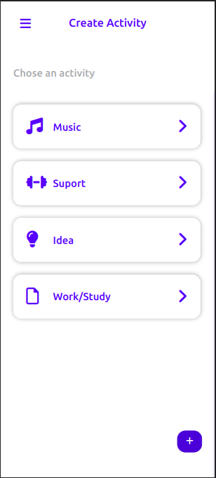
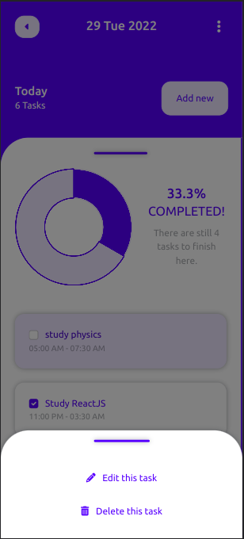
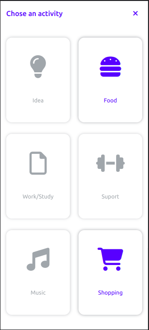

# Task management and to do list application with JavaScript OOP

Creating activities by category names & add some list to do into the activities with time period if you wish & saving them to the Local Storage.

